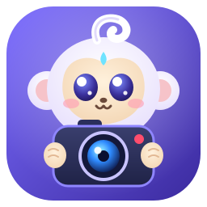
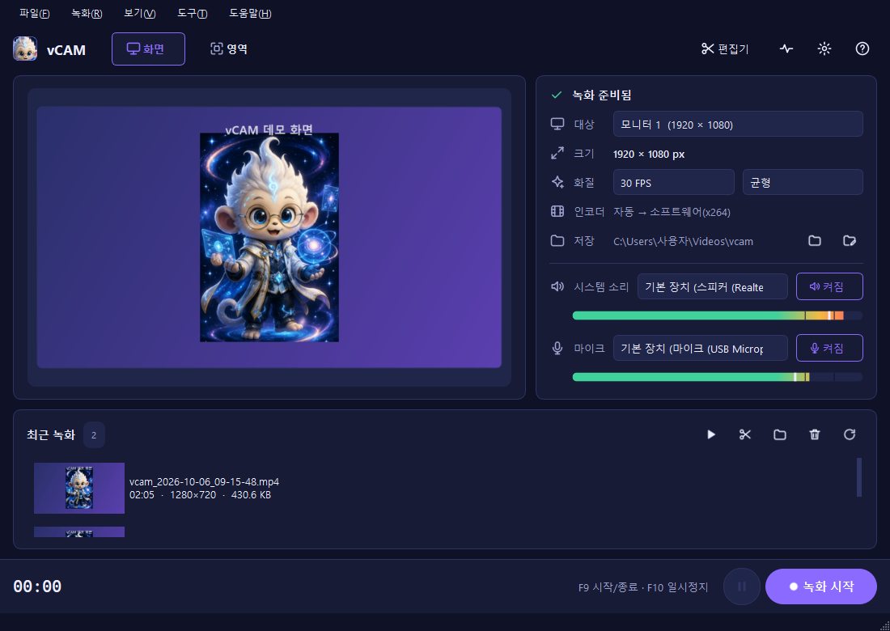
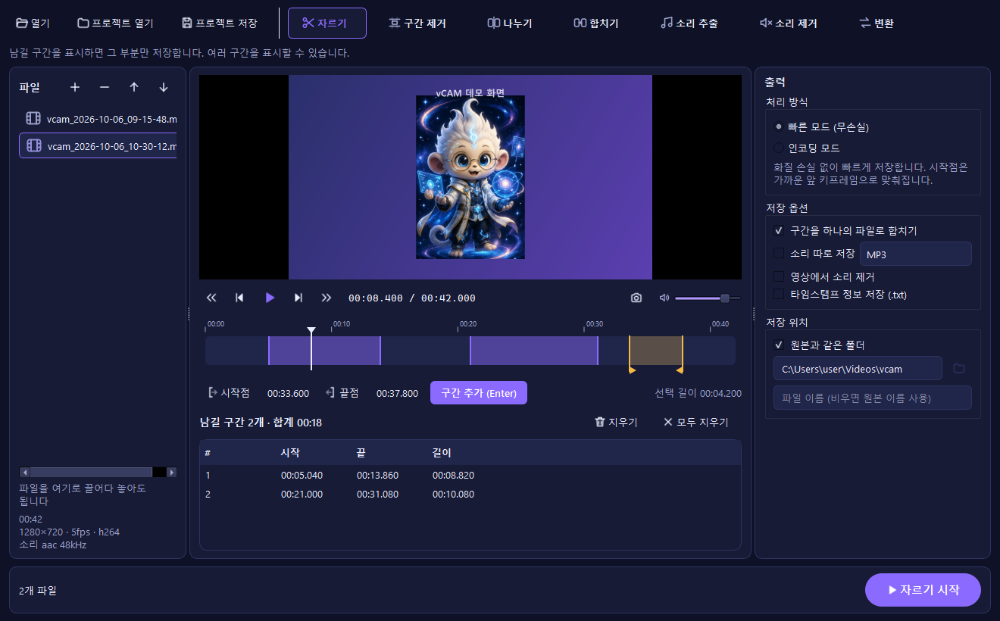
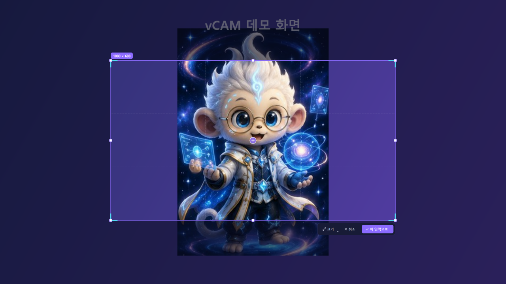
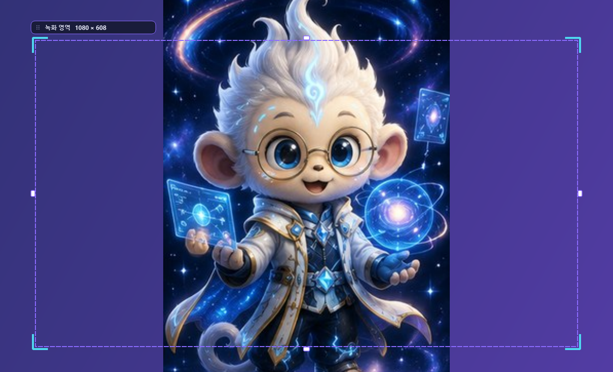
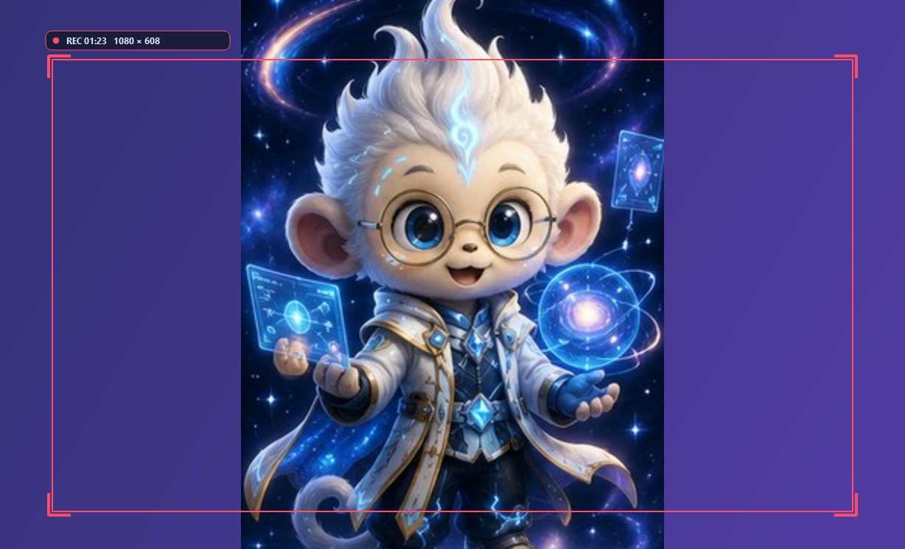

<div align="center">



# vCAM

**바로 켜서 바로 녹화하고, 자르고·합치고·변환까지 하는 Windows 화면 녹화 프로그램**

화면 전체나 원하는 영역을 PC 소리·마이크와 함께 MP4로 녹화합니다.<br>
녹화한 화면과 소리는 내 PC 밖으로 나가지 않습니다.

[**⬇ 최신 버전 내려받기**](https://github.com/betona1/vcam/releases/latest) ·
[📘 사용설명서](docs/USER_GUIDE.md) ·
[📝 변경 기록](CHANGELOG.md)

</div>



## 주요 기능

| | |
| --- | --- |
| 🖥️ **화면 / 영역 녹화** | 모니터 전체, 또는 마우스로 지정한 영역만 녹화. 여러 모니터 지원 |
| 🟦 **가이드 프레임** | 녹화 범위가 바탕화면에 테두리로 표시되고, 모서리·변을 끌어 크기를, 위쪽 탭을 끌어 위치를 바꿉니다. 녹화 중에는 빨간색으로 잠깁니다 |
| 🔊 **소리 녹음** | 시스템 소리(PC에서 나는 소리)와 마이크를 각각 켜고 장치 선택, 실시간 음량 미터 |
| ⏯️ **간편한 조작** | F9 시작/종료, F10 일시정지, 3초 카운트다운, 녹화 중 작은 컨트롤 바 |
| ⚡ **하드웨어 가속** | NVIDIA·Intel·AMD 그래픽 인코더를 실제로 시험해 자동 선택, 없으면 소프트웨어 인코더 |
| 🛟 **안전한 저장** | 녹화 중 오류나 강제 종료가 나도 기록된 부분을 복구. 파일을 덮어쓰지 않음 |
| ✂️ **동영상 편집기** | 자르기(여러 구간) · 구간 제거 · 나누기(균등·시간·직접) · 합치기 · 소리 추출(MP3 등) · 소리 제거 — **빠른 모드(무손실)** 와 **인코딩 모드(프레임 단위)** |
| ⇄ **형식 변환** | MP4 · MKV · WebM · AVI · MOV · WMV · FLV · M4V · TS · MPEG · GIF, 코덱(H.264 · HEVC · AV1 · VP9 · Xvid…) · 크기 · FPS · 품질 · 속도 · 회전, 일괄 처리 |
| 🔄 **자동 업데이트** | 새 버전이 나오면 자동으로 내려받아 다시 시작할 때 설치 |
| 🌗 **라이트 / 다크 테마** | Windows 설정을 따르거나 직접 선택 |



| 영역 지정 | 가이드 프레임 | 녹화 중 |
| --- | --- | --- |
|  |  |  |

## 설치

1. [**릴리스 페이지**](https://github.com/betona1/vcam/releases/latest)에서 `vcam-<버전>-win64.zip`을 내려받습니다.
2. 원하는 곳(예: `C:\Tools`)에 압축을 풀고 `vcam\vcam.exe`를 실행합니다.
   - 처음 실행할 때 Windows SmartScreen이 경고하면 **추가 정보 → 실행**을 누르세요(코드 서명이 아직 없습니다).
   - `C:\Program Files`처럼 쓰기 권한이 없는 곳에 두면 자동 업데이트가 설치까지는 하지 못하고 안내만 합니다.
3. **FFmpeg**가 필요합니다. 명령 프롬프트에서 한 번만 실행하세요.
   ```
   winget install Gyan.FFmpeg
   ```
   설치하지 않고 실행하면 앱이 안내하며, **설정 → FFmpeg 위치**에서 `ffmpeg.exe`를 직접 지정할 수도 있습니다.

**요구 사항:** Windows 10(2004 이상) 또는 Windows 11, 64비트

## 빠른 사용법

1. 위쪽 **[화면]**(모니터 전체) 또는 **[영역]**(드래그로 지정)을 고릅니다.
2. 오른쪽에서 **시스템 소리 / 마이크**를 켜고 음량 막대가 움직이는지 확인합니다.
3. **F9**(또는 **● 녹화 시작**) → 3초 뒤 녹화 시작
4. 다시 **F9** → 저장. 결과는 `동영상\vcam` 폴더와 앱 아래쪽 **최근 녹화**에 나타납니다.
5. 자르거나 합치거나 변환하려면 **✂ 편집기**(Ctrl+E)를 엽니다.

자세한 내용은 [📘 사용설명서](docs/USER_GUIDE.md)를 보세요.

## 자동 업데이트

앱은 시작할 때 이 저장소의 [최신 릴리스](https://github.com/betona1/vcam/releases/latest)를 확인합니다.
새 버전이 있으면 백그라운드에서 내려받아 **SHA-256 체크섬을 검증**한 뒤 "지금 업데이트 / 나중에"를 묻습니다.
설치는 앱이 종료된 뒤 별도 스크립트가 파일을 교체하며, 실패하면 이전 버전으로 되돌립니다.
업데이트 확인 때 보내는 정보는 앱 버전뿐이며, **설정 → 새 버전을 자동으로 확인**에서 끌 수 있습니다.

## 개인정보

- 화면, 소리, 파일 이름은 어디로도 보내지 않습니다. 모든 녹화와 처리는 내 PC 안에서 끝납니다.
- 마이크는 사용자가 켰을 때만 엽니다.
- 다른 사람의 대화나 회의를 녹화할 때는 **상대방의 동의가 필요할 수 있습니다.**

---

## 개발자용

```powershell
.\scripts\dev.ps1            # 가상환경 준비 후 앱 실행 (--debug 로 자세한 로그)
.\scripts\test.ps1           # Ruff + 전체 테스트 (실제 화면·소리 스모크 테스트 포함)
.\scripts\test.ps1 -Fast     # 스모크 테스트 제외
.\scripts\build.ps1          # 실행 파일 + 배포 zip/sha256 빌드
python scripts\measure_av_drift.py --minutes 10   # 실제 장치로 A/V 싱크 측정
python scripts\render_screenshots.py              # 문서 스크린샷 다시 만들기(데모 화면 사용)
```

- 기술: Python 3.12+, PySide6(Qt 6), DXcam / python-mss, SoundCard(WASAPI), FFmpeg
- 구조: `MainWindow → RecordingController → (capture / audio / encoding / platform)` 한 방향으로만 호출합니다.
  캡처·오디오·인코딩은 작업 스레드에서 돌고, 영상과 소리는 하나의 세션 시계를 공유해 싱크를 맞춥니다.
- 개발 지침: [`CLAUDE.md`](CLAUDE.md)

### 새 버전 배포

1. `src/vcam/__init__.py`의 `__version__`을 올리고 [`CHANGELOG.md`](CHANGELOG.md)에 변경 사항을 적습니다.
2. 커밋 후 같은 버전의 태그를 올립니다.
   ```
   git tag v0.3.0
   git push origin main --tags
   ```
3. GitHub Actions(`release.yml`)가 테스트 → 빌드 → 릴리스 생성까지 자동으로 합니다.
   설치된 앱들은 다음 실행 때 새 버전을 받습니다.

### 품질 기준 (실측)

| 항목 | 목표 | 결과 (v0.2.0) |
| --- | --- | --- |
| 10분 녹화 A/V 최대 어긋남 | 80ms 이하 (허용 150ms) | **41ms** |
| 최종 파일 영상·소리 길이 차이 | — | **0ms** |
| 10분 동안 빠진 프레임 (640×360 영역, 30fps, x264) | 기록 | 18,000장 중 3장 |

## 라이선스와 고지

소스 코드는 [MIT 라이선스](LICENSE)로 공개합니다. 자유롭게 사용·수정·배포할 수 있습니다.
단, **베이블링 캐릭터 그림**(`assets/brand/`, 앱 아이콘)은 MIT에 포함되지 않으며 저작권자에게 권리가 있습니다.
사용한 오픈 소스 구성 요소는 [THIRD_PARTY_NOTICES.md](THIRD_PARTY_NOTICES.md)에 정리되어 있습니다.
