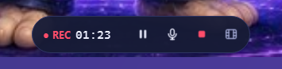
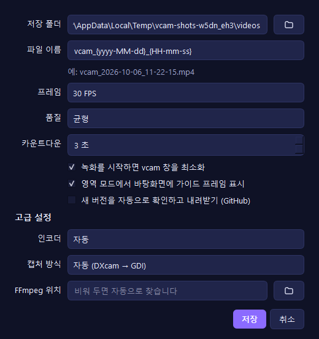
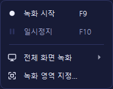

# vavelingCam 사용설명서


vavelingCam(줄여서 vcam)은 Windows 화면을 소리와 함께 MP4로 녹화하는 프로그램입니다.
이 설명서는 설치부터 녹화, 설정, 문제 해결까지 순서대로 안내합니다.

## 목차

1. [설치](#1-설치)
2. [첫 실행](#2-첫-실행)
3. [화면 구성](#3-화면-구성)
4. [무엇을 녹화할지 고르기](#4-무엇을-녹화할지-고르기)
5. [소리 설정](#5-소리-설정)
6. [녹화하기](#6-녹화하기)
7. [녹화한 영상 확인](#7-녹화한-영상-확인)
8. [설정](#8-설정)
9. [메뉴 한눈에 보기](#9-메뉴-한눈에-보기)
10. [단축키](#10-단축키)
11. [업데이트](#11-업데이트)
12. [녹화가 중간에 끊겼을 때 (복구)](#12-녹화가-중간에-끊겼을-때-복구)
13. [문제 해결](#13-문제-해결)
14. [파일 위치와 개인정보](#14-파일-위치와-개인정보)

---

## 1. 설치

### 1-1. 프로그램 내려받기

1. [릴리스 페이지](https://github.com/betona1/vcam/releases/latest)에서 **`vcam-<버전>-win64.zip`** 을 내려받습니다.
2. 압축을 풀 폴더를 정합니다. 예: `C:\Tools` 또는 `문서\vcam`
   > `C:\Program Files` 안에 두면 자동 업데이트가 파일을 바꿀 권한이 없어, 새 버전 안내만 하고 직접 설치해야 합니다.
3. 압축을 풀면 `vcam` 폴더 안에 **`vcam.exe`** 가 있습니다. 더블클릭해 실행합니다.
   - 바탕화면에 바로가기를 두려면 `vcam.exe`를 오른쪽 클릭 → **보내기 → 바탕 화면에 바로 가기 만들기**.
4. "Windows의 PC 보호" 창이 뜨면 **추가 정보 → 실행** 을 누릅니다. (아직 코드 서명을 하지 않은 프로그램이라 나오는 경고입니다.)

### 1-2. FFmpeg 설치 (한 번만)

vcam은 영상을 MP4로 만들 때 무료 프로그램 **FFmpeg**를 사용합니다.

- **쉬운 방법:** 시작 메뉴에서 "명령 프롬프트"를 열고 아래를 입력합니다.
  ```
  winget install Gyan.FFmpeg
  ```
  설치가 끝나면 vcam을 다시 실행하세요.
- **직접 지정:** FFmpeg를 다른 방법으로 받았다면 **설정(⚙) → 고급 설정 → FFmpeg 위치**에서 `ffmpeg.exe`를 고릅니다.
  같은 폴더에 `ffprobe.exe`도 있어야 합니다.

FFmpeg가 없으면 오른쪽 패널에 **"FFmpeg를 찾을 수 없습니다 — 진단 열기"** 버튼이 나타납니다.

## 2. 첫 실행

처음 실행하면 **녹화 동의 안내**가 한 번 나옵니다.

> 다른 사람의 대화나 화상 회의를 녹화·녹음할 때는 상대방의 동의가 필요할 수 있습니다.
> 저작권이 있는 콘텐츠는 허용된 범위에서만 녹화해 주세요.

**확인했습니다**를 누르면 메인 화면이 열립니다. 이 안내는 **도움말 → 녹화 동의 안내**에서 다시 볼 수 있습니다.

## 3. 화면 구성


| 위치 | 이름 | 하는 일 |
| --- | --- | --- |
| 맨 위 | **메뉴 바** | 파일·녹화·보기·도구·도움말 ([9장](#9-메뉴-한눈에-보기)) |
| 위쪽 가운데 | **[화면] [영역]** | 모니터 전체를 녹화할지, 지정한 영역만 녹화할지 고릅니다 |
| 위쪽 오른쪽 | **〰 ⚙ ?** | 시스템 진단, 설정, 사용 안내 |
| 왼쪽 | **미리보기** | 지금 녹화될 화면이 보입니다(녹화 중에는 멈춤) |
| 오른쪽 위 | **녹화 준비** | 상태, 녹화 대상, 크기, 화질(FPS·품질), 인코더, 저장 폴더 |
| 오른쪽 아래 | **소리** | 시스템 소리 / 마이크 켜기·끄기, 장치 선택, 음량 막대 |
| 아래 | **최근 녹화** | 저장된 영상 목록(썸네일·길이·해상도·크기) |
| 맨 아래 | **녹화 바** | 경과 시간, 일시정지 버튼, **● 녹화 시작** 버튼 |

상태 표시는 색과 글자를 함께 씁니다: **녹화 준비됨** → **곧 시작합니다** → **녹화 중** → **저장 중…** → **저장 완료**

## 4. 무엇을 녹화할지 고르기

### 4-1. 모니터 전체 — [화면]

**[화면]** 을 누르고 오른쪽 **대상** 목록에서 모니터를 고릅니다. 모니터가 여러 대면 "모니터 1, 2…"로 나옵니다.
메뉴 **녹화 → 전체 화면 녹화**에서도 고를 수 있습니다.

### 4-2. 원하는 부분만 — [영역]

1. **[영역]** 을 누르면 vcam 창이 잠시 숨고 화면 전체가 어두워집니다.
2. 녹화할 부분을 **마우스로 드래그** 합니다. 선택한 부분만 밝게 보이고, 왼쪽 위에 **실제 픽셀 크기**(예: `1080 × 608`)가 표시됩니다.

   

3. 다듬기
   - **흰 네모 핸들(8개)** 을 끌어 크기를 바꿉니다.
   - **가운데 ⊕** 또는 영역 안쪽을 끌어 위치를 옮깁니다.
   - **방향키**로 1픽셀씩, **Shift + 방향키**로 10픽셀씩 옮깁니다.
   - 화면 가장자리에 가까이 가면 자동으로 딱 붙습니다.
   - **크기 ▾** 버튼이나 **오른쪽 클릭**으로 프리셋을 고릅니다:
     이 모니터 전체 · 마지막 영역 · 1280×720 · 1920×1080 · 854×480 · 1080×1080 · 비율 16:9 / 4:3 / 1:1
   - 점선은 화면을 3등분한 구도 보조선입니다(녹화에는 나오지 않음).
4. **[✓ 이 영역으로]**, **Enter**, 또는 영역 **더블클릭** 으로 확정합니다. **Esc** 는 취소입니다.

> 영역은 모니터 한 대 안에서만 지정할 수 있습니다. 클릭만 하고 드래그하지 않으면 그 모니터 전체가 선택됩니다.

### 4-3. 가이드 프레임 — 녹화 범위를 바탕화면에서 바로 조절

영역을 확정하면 바탕화면에 **녹화 범위 테두리(가이드 프레임)** 가 남습니다.


- **모서리·변**을 마우스로 끌면 크기가 바뀝니다.
- 위쪽 **탭(⠿ 녹화 영역 1080 × 608)** 을 끌면 위치가 옮겨집니다.
- 탭을 **더블클릭**하면 영역을 처음부터 다시 지정합니다.
- 테두리 **안쪽은 클릭이 그대로 통과**하므로, 프레임을 띄워 둔 채 아래 프로그램을 평소처럼 쓸 수 있습니다.
- 녹화가 시작되면 테두리가 **빨간색으로 잠기고** 탭에 `REC 경과시간`이 표시됩니다.

  

- 테두리·탭은 녹화 범위 **바깥**에 그려지고, Windows 10 2004 이상에서는 녹화 결과에서도 제외되므로 영상에 찍히지 않습니다.
- 숨기려면 **보기 → 가이드 프레임 표시** 를 끕니다.

## 5. 소리 설정

오른쪽 패널 아래쪽에서 두 가지 소리를 따로 켜고 끕니다.

| 항목 | 녹음되는 소리 | 기본값 |
| --- | --- | --- |
| 🔊 **시스템 소리** | PC에서 나는 모든 소리(동영상, 강의, 알림음 등) | 켜짐 |
| 🎤 **마이크** | 내 목소리 | 꺼짐 |

- 오른쪽 **[켜짐 / 꺼짐]** 버튼으로 켜고 끕니다.
- 가운데 목록에서 **장치**를 고릅니다. "기본 장치"는 Windows 소리 설정의 기본 장치를 따라갑니다.
  - 시스템 소리는 *소리가 나오는 장치*(스피커·헤드셋·모니터)를 고릅니다.
- 아래 **음량 막대**로 소리가 들어오는지 녹화 전에 확인합니다.
  - 초록 → 노랑 → 빨강 순으로 커집니다. 빨강까지 자주 가면 소리가 너무 큰 것입니다.
  - 흰 세로 눈금은 최근 최고 음량입니다. 막대에 마우스를 올리면 dB 값이 보입니다.
  - 막대 대신 글자가 보이면: **꺼짐**(꺼 둠) · **연결 중…** · **다시 연결 중…** · **사용 불가**(장치 없음/오류) · **음소거**
- 두 소리를 모두 켜면 저장할 때 **하나로 합쳐집니다**.
- 마이크를 켜면 Windows 작업 표시줄에 마이크 사용 표시가 나타납니다. 마이크는 켰을 때만 사용합니다.

> **녹화 중 장치가 빠지면?** (예: 블루투스 헤드셋 연결 끊김) vcam이 자동으로 다시 연결하고, 끊긴 동안은 무음으로 채워 영상과 소리가 어긋나지 않게 합니다. 화면 아래 상태 줄에 안내가 나옵니다.

## 6. 녹화하기

### 6-1. 시작

**F9** 를 누르거나 **● 녹화 시작** 버튼을 누릅니다.

1. 녹화할 화면 가운데에 **3 → 2 → 1 카운트다운**이 나옵니다. 이때 **F9** 를 다시 누르거나 숫자를 클릭하면 취소됩니다.
2. 녹화가 시작되면 vcam 창은 **자동으로 최소화**되고, 작은 **녹화 컨트롤 바**가 녹화 범위 바깥에 나타납니다.



| 버튼 | 기능 |
| --- | --- |
| ● REC 01:23 | 녹화 중 표시와 경과 시간 (일시정지 중엔 ❚❚ 일시정지) |
| ❚❚ / ▶ | 일시정지 / 재개 (F10) |
| 🎤 | 마이크만 잠시 음소거 / 해제 (마이크를 켰을 때만 보임) |
| ■ | 녹화 종료 (F9) |
| 🎞 | vcam 창 다시 열기 |

컨트롤 바는 마우스로 끌어 옮길 수 있고, 녹화 결과에는 찍히지 않습니다.

### 6-2. 일시정지

**F10** 을 누르면 멈추고, 다시 누르면 이어서 녹화합니다. **일시정지한 구간은 영상에서 빠집니다** (영상과 소리 모두).

### 6-3. 종료와 저장

**F9** 또는 컨트롤 바의 **■** 를 누르면 저장이 시작됩니다(상태: *저장 중…*).

- 영상은 임시 파일로 만든 뒤 재생 가능한지 검사하고, 문제가 없을 때만 최종 이름으로 저장합니다.
- 같은 이름의 파일이 있으면 덮어쓰지 않고 `이름 (2).mp4` 처럼 저장합니다.
- 저장이 끝나면 vcam 창이 다시 열리고 아래쪽에 **저장됨: 파일명 · 길이 · 크기** 와 **▶ 재생 / 📁 폴더** 버튼이 나옵니다.

> 녹화 중에 vcam 창을 닫으면 "지금까지 녹화한 내용을 저장하고 종료할까요?"라고 묻고, **예**를 누르면 저장한 뒤 닫습니다.

## 7. 녹화한 영상 확인

메인 화면 아래 **최근 녹화** 목록에 저장 폴더의 영상이 최신순으로 나옵니다.

| 동작 | 방법 |
| --- | --- |
| 재생 | 항목 **더블클릭**, 또는 선택 후 위쪽 **▶** |
| 파일 위치 열기 | 선택 후 **📁**, 또는 오른쪽 클릭 → **폴더에서 보기** |
| 삭제 | 선택 후 **🗑**, 또는 오른쪽 클릭 → **휴지통으로 이동** (확인 후 휴지통으로, 복원 가능) |
| 목록 새로 고침 | **⟳** |

저장 폴더 열기: 오른쪽 패널 **저장** 줄의 📁 버튼, 또는 **파일 → 저장 폴더 열기**

## 8. 설정

위쪽 **⚙** 또는 **도구 → 설정…**



| 항목 | 설명 | 기본값 |
| --- | --- | --- |
| 저장 폴더 | 녹화 파일이 저장될 곳 | `동영상\vcam` |
| 파일 이름 | 이름 규칙. `{yyyy-MM-dd}`, `{HH-mm-ss}`, `{yyyy}` `{MM}` `{dd}` `{HH}` `{mm}` `{ss}` 를 쓸 수 있고 아래에 예시가 보입니다 | `vcam_{yyyy-MM-dd}_{HH-mm-ss}` |
| 프레임 | 초당 프레임 수. 15 / 24 / 30 / 60 | 30 FPS |
| 품질 | 작은 용량 / 균형 / 고화질 | 균형 |
| 카운트다운 | 시작 전 대기 시간(0~10초) | 3초 |
| 녹화 시작 시 창 최소화 | vcam 창이 녹화에 찍히지 않게 숨김 | 켜짐 |
| 가이드 프레임 표시 | 영역 모드에서 바탕화면 테두리 표시 | 켜짐 |
| 새 버전 자동 확인 | 시작할 때 GitHub에서 새 버전 확인·다운로드 | 켜짐 |
| **고급** 인코더 | 자동(NVIDIA → Intel → AMD → 소프트웨어) 또는 직접 지정 | 자동 |
| **고급** 캡처 방식 | 자동(DXcam → GDI) / DXcam(고성능) / GDI(호환성) | 자동 |
| **고급** FFmpeg 위치 | 비워 두면 자동으로 찾음 | 비움 |

FPS와 품질은 메인 화면 **화질** 줄에서도 바로 바꿀 수 있습니다.

> **팁:** 60 FPS나 고화질은 파일이 커지고 PC 부담이 늘어납니다. 강의·업무 녹화는 30 FPS · 균형이면 충분합니다.

## 9. 메뉴 한눈에 보기

| 메뉴 | 항목 |
| --- | --- |
| **파일** | 저장 폴더 열기 · 저장 폴더 변경… · 종료 |
| **녹화** | 녹화 시작/종료 (F9) · 일시정지 (F10) · 전체 화면 녹화 ▸ 모니터 선택 · 녹화 영역 지정… |
| **보기** | 가이드 프레임 표시 · 테마 ▸ 시스템 설정 따르기 / 라이트 / 다크 |
| **도구** | 시스템 진단… · 미완료 녹화 복구… · 로그 폴더 열기 · 설정… |
| **도움말** | 사용 안내 · 사용설명서(온라인) · 녹화 동의 안내 · 업데이트 확인… · vavelingCam 정보 |



## 10. 단축키

| 키 | 기능 | 사용 위치 |
| --- | --- | --- |
| **F9** | 녹화 시작 / 종료 (카운트다운 중엔 취소) | 어디서나 (다른 프로그램 사용 중에도) |
| **F10** | 일시정지 / 재개 | 어디서나 |
| **Enter** | 영역 확정 | 영역 선택 화면 |
| **Esc** | 영역 선택 취소 | 영역 선택 화면 |
| **방향키 / Shift+방향키** | 영역 1px / 10px 이동 | 영역 선택 화면 |

F9·F10을 다른 프로그램이 이미 쓰고 있으면 등록되지 않고 상태 줄에 안내가 나옵니다. 이때는 버튼으로 조작하세요.

## 11. 업데이트

- vcam은 **시작하고 5초 뒤** 새 버전이 있는지 확인합니다.
- 새 버전이 있으면 **백그라운드에서 내려받고 파일이 손상되지 않았는지(체크섬) 확인**한 뒤 물어봅니다.
  - **지금 업데이트**: vcam이 닫히고 새 버전으로 바뀐 뒤 자동으로 다시 열립니다.
  - **나중에**: vcam을 닫을 때 설치되고, 다음에 열면 새 버전입니다.
- 녹화 중에 새 버전이 준비되면 녹화를 방해하지 않고, 앱을 닫을 때 설치합니다.
- 설치 중 문제가 생기면 이전 버전으로 되돌립니다. 기록은 `로그 폴더\update.log`에 남습니다.
- 직접 확인: **도움말 → 업데이트 확인…**
- 끄기: **설정 → 새 버전을 자동으로 확인하고 내려받기** 체크 해제
- 쓰기 권한이 없는 폴더(예: Program Files)에 설치했다면 자동 설치 대신 **릴리스 페이지 열기**를 안내합니다.

## 12. 녹화가 중간에 끊겼을 때 (복구)

정전, 강제 종료, PC 멈춤 등으로 녹화가 정상적으로 끝나지 않아도 **이미 기록된 부분은 대부분 살릴 수 있습니다**(끊기기 직전 1초 안팎 제외).

- 다음에 vcam을 켜면 **"미완료 녹화 복구"** 창이 자동으로 나옵니다.
  - **복구**: 남은 부분을 `원래이름_복구.mp4`로 저장합니다(소리 포함).
  - **버리기**: 임시 파일을 휴지통으로 옮깁니다.
  - **나중에**: 그대로 두고, 언제든 **도구 → 미완료 녹화 복구…** 에서 다시 할 수 있습니다.
- 녹화 중 디스크 공간이 500MB 아래로 떨어지면 자동으로 안전하게 멈추고 저장합니다.
- 소리를 합치는 단계에서 문제가 생기면 **영상만이라도 저장**하고 알려 줍니다.

## 13. 문제 해결

먼저 **도구 → 시스템 진단…** 을 열어 보세요. 각 항목에 ✓(정상) / ⚠(문제)와 해결 방법이 표시됩니다.

| 증상 | 확인할 것 |
| --- | --- |
| "FFmpeg를 찾을 수 없습니다" | [1-2](#1-2-ffmpeg-설치-한-번만)대로 FFmpeg 설치 후 vcam 다시 실행 |
| 녹화 버튼을 눌러도 시작되지 않음 | 대상(화면/영역)을 골랐는지, 저장 폴더에 쓸 수 있는지, 여유 공간이 1GB 이상인지 |
| 소리가 녹음되지 않음 | 시스템 소리가 **켜짐**인지, 음량 막대가 움직이는지, **장치 목록에서 실제로 소리가 나오는 장치**를 골랐는지 |
| 마이크 항목이 "연결된 마이크 없음" | 마이크 연결 후 vcam 다시 실행. Windows 설정 → 개인 정보 → 마이크에서 앱 접근 허용 확인 |
| 영상이 끊기거나 느림 | 화질을 30 FPS · 균형으로, 영역을 작게. 진단에서 하드웨어 인코더(NVIDIA/Intel/AMD) 사용 여부 확인 |
| 녹화 결과가 검은 화면 | 일부 보호된 영상(넷플릭스 등)과 보안 화면은 Windows가 녹화를 막습니다. 설정 → 캡처 방식을 **GDI(호환성)** 로 바꿔 시험 |
| F9가 동작하지 않음 | 다른 프로그램이 F9를 쓰는 중일 수 있음(시작할 때 상태 줄 안내). 버튼으로 조작 |
| 가이드 프레임이 거슬림 | 보기 → 가이드 프레임 표시 끄기 |
| 오류 내용을 알려 주고 싶을 때 | **도구 → 로그 폴더 열기** 의 `vcam.log` 파일을 첨부해 [이슈](https://github.com/betona1/vcam/issues)에 올려 주세요. 로그에는 화면 내용이나 키 입력이 기록되지 않습니다. 보내기 전에 내용을 한 번 확인해 주세요 |

## 14. 파일 위치와 개인정보

| 내용 | 위치 |
| --- | --- |
| 녹화 영상 | `동영상\vcam` (설정에서 변경) |
| 설정 | `%LOCALAPPDATA%\vcam\settings.json` |
| 로그 | `%LOCALAPPDATA%\vcam\logs\` |
| 녹화 중 임시 파일 | `%LOCALAPPDATA%\vcam\sessions\` (정상 저장 후 자동 삭제) |
| 업데이트 임시 파일 | `%LOCALAPPDATA%\vcam\updates\` |

`%LOCALAPPDATA%`는 탐색기 주소창에 그대로 입력하면 열립니다.

**개인정보**

- 녹화한 화면·소리·파일 이름은 **어디로도 전송하지 않습니다.**
- 인터넷 연결은 업데이트 확인(GitHub) 한 가지뿐이며 앱 버전만 전달됩니다. 설정에서 끌 수 있습니다.
- 마이크는 켰을 때만 사용합니다.
- 오류 로그는 자동으로 전송하지 않습니다.

**프로그램 지우기:** `vcam` 폴더를 삭제하면 됩니다. 설정까지 지우려면 `%LOCALAPPDATA%\vcam` 폴더도 삭제하세요(녹화 영상은 `동영상\vcam`에 그대로 남습니다).
